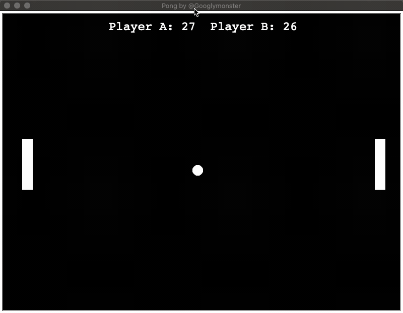

# PythonPong

A Pong game written in Python3 for two players.

## Getting Started

Before you clone the repository you first want to make sure you have [Python3](https://www.python.org/downloads/). Then you can clone the code.

`git clone https://github.com/Googlymonster/PythonPong.git`

Then run the following code in the terminal.

`python3 pong.py`

The "w" represents up and "s" represents down for Player A. The up and down arrow keys are for Player B. The game will continuously run until you close out of it.

## Have Fun

